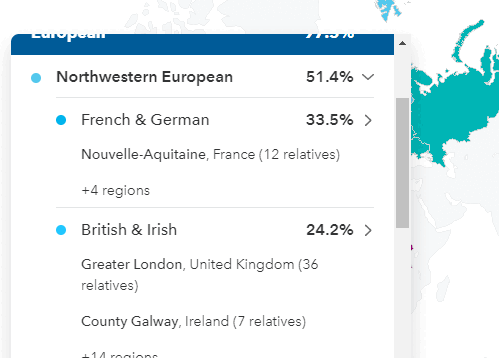

<h1 align="center">
  
   
   
  Region Relatives 4 23andMe
   
   
</h1>

<h3 align="center">
  A Chrome extension for 23andMe to reveal how many relatives you have per region.
</h3>

<h1 align="center">
  </a>
   
   
</h1>